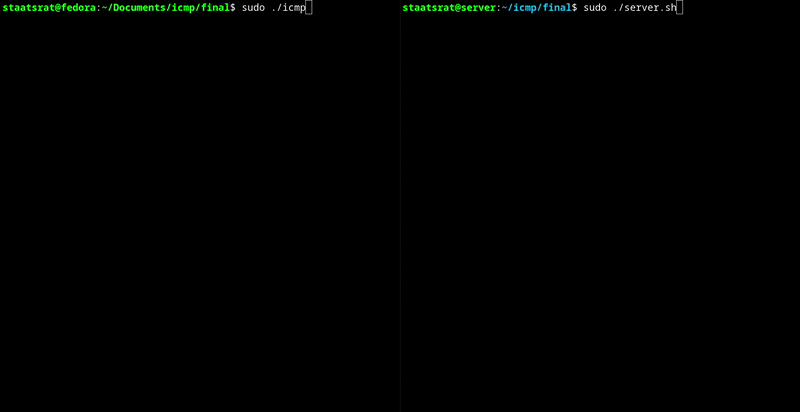

# icmp-communication


#### The tool is still work in progress

A C-based tool for covert data transmission over ICMP packet sizes without using standard payload.

>  **WARNING:**
> This tool has no authentication, no encryption and no IP whitelist. The server executes every received command as root. Anyone who can reach the server over the network can run arbitrary commands on it whether from the same LAN or from anywhere on the internet, if the server is publicly reachable. Only use this in an isolated lab environment.

# Client



#### Download
```
git clone https://github.com/Staatsrat/icmp_c2.git
cd icmp_c2
```

#### 1. Compile

Compile the icmp.c program using gcc: 
```
gcc -o icmp icmp.c
```

#### 2. Start

To start the program you will need sudo since otherwise the program can't use sockets.
Use the command 
```
sudo ./icmp
```

#### 3. Send

As soon as the program starts you will get a `Enter the server ip:` Here you have to enter the server IP where the server.sh pogram is running. After that you get `user@<server_ip>:~$` enter the commands. (The user and the ~ are static till now.) The output of every command is printed back to you directly under the prompt.

# Server

Then on the receiving device:

#### Download
```
git clone https://github.com/Staatsrat/icmp_c2.git
cd icmp_c2
```

#### 1. Start script

Start the server.sh script using
```
chmod +x server.sh
sudo ./server.sh
```

You need sudo so the program can start tcpdump.
The server runs in the foreground and produces no visible output on the server side. Leave it running. All results are sent back to the client.

### NOW you can execute!

## If you are running RaspberryPi os
you will have to run `sudo apt update && sudo apt install gawk` for the server.sh pogramm.

## Things that don't work
no encryption.

Later I will make a YouTube video on this too.
